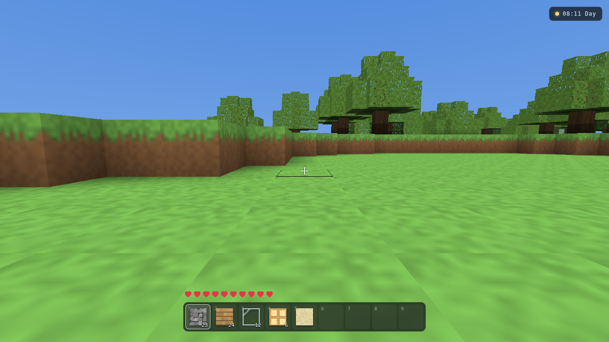
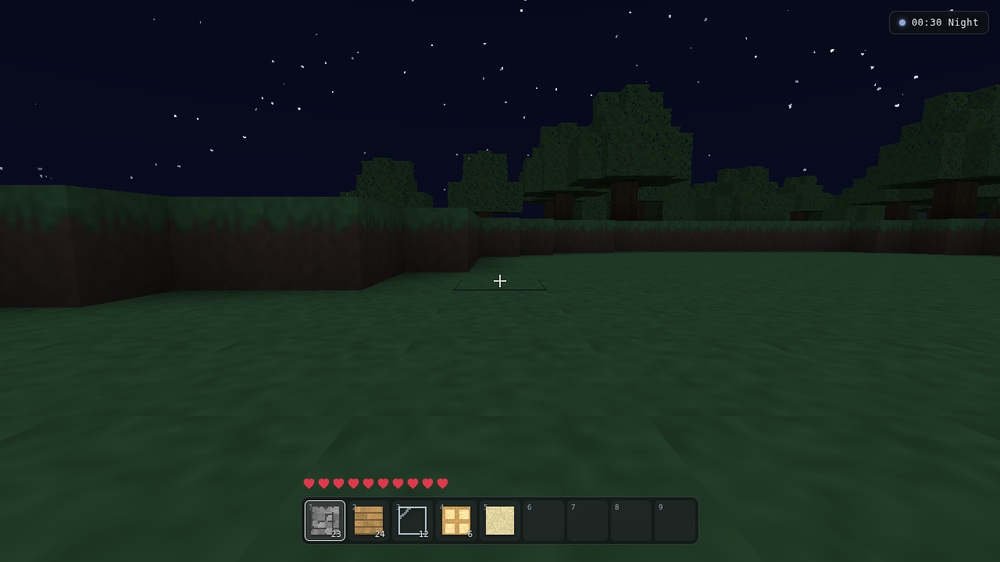
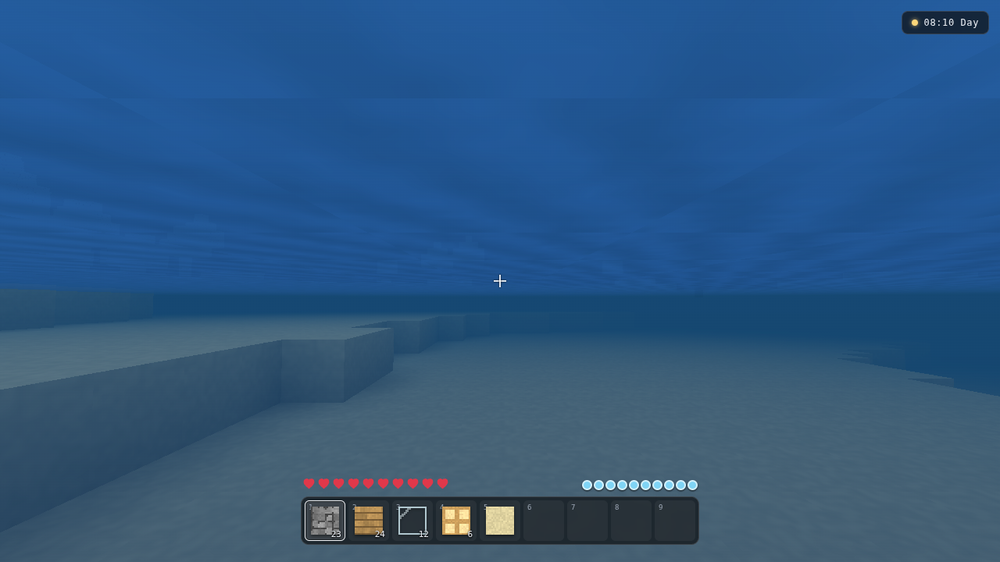

# Voxel Survival

A first-person voxel survival game built from scratch: procedural infinite
terrain, block breaking and placing, survival mechanics and a day/night cycle.

No game engine, no build step, no external libraries, and no asset files — the
renderer is hand-written WebGL2 and every texture is painted procedurally at
startup.



| Night                               | Underwater                                    |
| ----------------------------------- | --------------------------------------------- |
|  |  |

## Run it

ES modules cannot be loaded over `file://`, so the game needs a local server.
Any of these work:

```bash
./run.sh                 # starts a server and opens your browser
npm start                # same server, no browser launch
python3 -m http.server   # if you would rather not use Node
```

Then open <http://127.0.0.1:8080>. Click **Play** to lock the mouse.

Requires a browser with WebGL2 (any current Chrome, Firefox, Edge or Safari)
and, for `npm start`, Node 18+. There is nothing to install.

### Choosing a world

Worlds are fully determined by their seed. Append `?seed=` to replay one:

```
http://127.0.0.1:8080/?seed=1337      # numeric seed
http://127.0.0.1:8080/?seed=hello     # text is hashed to a seed
```

Without the parameter a random seed is used and logged to the console.

## Controls

| Action             | Input                                               |
| ------------------ | --------------------------------------------------- |
| Move               | <kbd>W</kbd> <kbd>A</kbd> <kbd>S</kbd> <kbd>D</kbd> |
| Look               | Mouse                                               |
| Jump / swim up     | <kbd>Space</kbd>                                    |
| Sprint             | <kbd>Ctrl</kbd>                                     |
| Sneak              | <kbd>Shift</kbd>                                    |
| Break block        | Hold left mouse                                     |
| Place block        | Right mouse                                         |
| Select hotbar slot | <kbd>1</kbd>–<kbd>9</kbd> or scroll wheel           |
| Toggle flight      | <kbd>F</kbd>                                        |
| Debug overlay      | <kbd>F3</kbd>                                       |
| Release cursor     | <kbd>Esc</kbd>                                      |

## What's implemented

**Procedural world.** Terrain is generated per 16×128×16 chunk from seeded
value noise. Three independent fields decide its shape: a low-frequency
_continent_ field that moves regions above or below sea level, a _relief_ field
that decides how mountainous an area may become, and surface plus ridged noise
that supply the actual bumps — ridged noise fades in only on high-relief
terrain, so plains stay flat while mountains get proper crests. Separate
temperature and humidity fields select between seven biomes (ocean, beach,
plains, forest, hills, desert, snowy plains). 3D noise carves caves, always
leaving a solid cap under the surface so the terrain skin is never breached.
Ore veins, oak trees and cacti are placed deterministically; trees are
generated with a two-block margin beyond each chunk so a canopy straddling a
chunk border comes out identical from either side.

**Rendering.** Each chunk is meshed into a single vertex buffer with hidden
faces culled. Every vertex carries baked ambient occlusion (the classic
four-neighbour rule, with the quad split along whichever diagonal keeps the
darkest corners together to avoid gradient seams) plus a skylight value derived
from the terrain heightmap, so caves, overhangs and the ground under a tree
canopy all fall into shade. Block textures live in a WebGL2 **texture array**,
one tile per layer, which is what makes mipmapping possible: a flat atlas would
bleed neighbouring tiles into each other at lower mip levels. Chunks outside
the view frustum are culled, and distance fog matched to the horizon colour
hides the edge of the loaded world.

**Day/night.** A single `time` value drives sun direction, the sky gradient,
the light tint fed to the world shader, fog colour and star visibility. Sunrise
and sunset linger through a wide golden-hour band. The sky, including its sun,
moon and starfield, is one full-screen triangle whose fragment shader
reconstructs a world-space view ray per pixel — it needs no geometry at all.

**Survival.** Health with regeneration, fall damage measured from the peak of a
fall, drowning with a breath meter, and death and respawn. Mining takes time
proportional to block hardness and shows progress as a ring around the
crosshair; broken blocks drop into a nine-slot hotbar, and placing consumes
them.

**Streaming.** Chunks load and unload around the player on a per-frame time
budget. Generation and meshing each get a guaranteed slice of that budget —
letting generation consume all of it starves meshing and leaves the player
standing in an invisible world. Block data is generated one ring wider than the
render distance so every mesh has real neighbours to cull and shade against.

## Code layout

```
index.html            markup and all HUD styling
serve.js              zero-dependency static server
run.sh                launcher (Node or Python)
src/
  config.js           all tuning constants
  main.js             entry point, seed resolution
  core/
    math.js           4x4 matrices, vectors, easing
    gl.js             WebGL2 context, shader/program/texture helpers
    shaders.js        GLSL sources
    atlas.js          procedural block textures
    input.js          keyboard, mouse, pointer lock
    frustum.js        frustum extraction and AABB tests
  world/
    blocks.js         block registry and properties
    noise.js          seeded value noise, fBm, ridged noise
    biomes.js         terrain height and biome selection
    generator.js      chunk fill: terrain, caves, ores, structures
    chunk.js          chunk storage and heightmap
    mesher.js         face culling, ambient occlusion, vertex output
    world.js          chunk map, streaming, block edits
    raycast.js        voxel ray traversal for targeting
  render/
    renderer.js       GPU resources and the frame
    camera.js         projection and view matrices
  game/
    game.js           frame loop, wiring, interaction
    player.js         movement, collision, survival state
    inventory.js      hotbar
    daynight.js       time of day and its palettes
  ui/
    hud.js            DOM heads-up display
test/
  run.mjs             runs every suite
  world.mjs           generation, meshing, raycasting
  physics.mjs         collision, gravity, fall damage, drowning
  browser.mjs         end-to-end smoke test in headless Chromium
```

## Tests

```bash
npm test
```

`world` and `physics` are pure Node and always run. `browser` boots the real
game in headless Chromium with a software GL backend and checks that chunks
stream in, geometry reaches the rasteriser, the frame is neither black nor a
flat colour, breaking and placing work, water and drowning behave, and that
nothing logs an error or a GL error. It skips itself if Playwright is not
installed:

```bash
npm install --save-dev playwright && npx playwright install chromium
```

## Tuning

Everything adjustable lives in `src/config.js` — render distance, chunk size,
player speeds and jump height, gravity, reach, damage thresholds, day length
and the per-frame streaming budget. `RENDER_DISTANCE` is the main performance
dial; lower it on weak hardware, raise it for longer views.

## Known limitations

- Lighting is baked per-vertex from a heightmap rather than a propagating light
  volume, so lamps illuminate only their own faces instead of casting light on
  nearby blocks.
- The world is not persisted; edits live in memory and are lost when a chunk
  unloads or the page reloads.
- There are no mobs, crafting or item entities — mining places blocks directly
  into the hotbar.
- Chunk generation and meshing run on the main thread under a time budget
  rather than in a worker, so very low render distances stream fastest.
